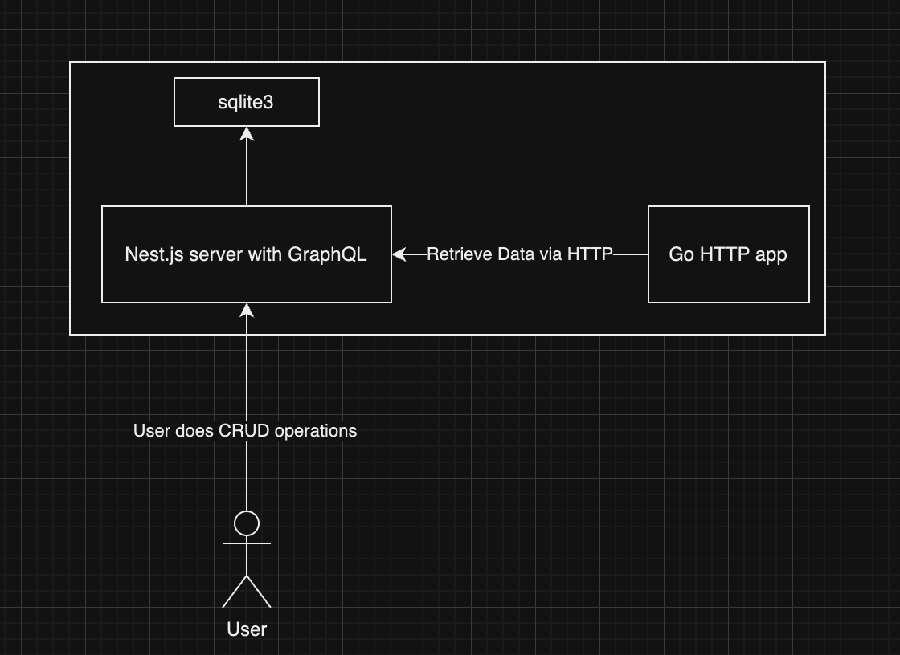

# Nest.js GraphQL and Go Data Fetcher

User can do CRUD operations to cat class via graphQL served on nest.js. Data gets saved to sqlite3 database. Go service can retrieve data created by user via HTTP GET method to nest.js.



# Local Development
```bash
cd go-data-fetcher-service
go run app.go

cd nest-graphql-service
npm i
npm start
```

# Queries
Go to http://localhost:3000/graphql
## Create Cat
```json
mutation {
  createCat(catInput: { name: "Maestro", age: 3, breed: "Smokin" }) {
    id
    name
    age
    breed
  }
}
```

## Get all cats
```json

query {
  cats {
    id
    name
    age
    breed
  }
}
```
## Get cat with id
```json

query {
  cat(id: 2) {
    id
    name
    breed
  }
}
```

## Update Cat
```json

mutation {
  updateCat(id: 1, catInput: { name: "Whiskers", age: 5, breed: "Siamese" }) {
    id
    name
    age
    breed
  }
}
```

## Delete Cat
```json

mutation {
  deleteCat(id: 4)
}
```

# Unit Tests
```json
npm test
```

# Retrieve Cats data via Go Service
Call http://localhost:8090/get_cats to retrieve all the cats.